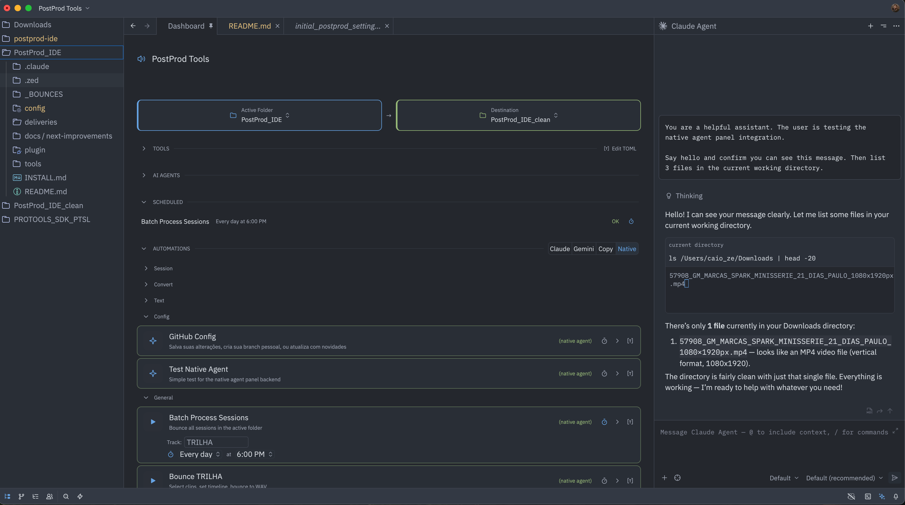

# PostProd IDE

A professional automation platform built as a [Zed](https://github.com/zed-industries/zed) fork. Domain-agnostic — designed for audio post-production, video, financial analysis, software development, or any workflow that benefits from agent-driven automation.



## What it does

PostProd IDE adds a **TOML-driven dashboard** to Zed. Every `.toml` file in a config directory becomes a clickable button — a tool that runs a binary, or an automation that dispatches a prompt to an AI agent. No rebuilds needed. Edit a TOML, and the dashboard picks it up within seconds.

**Key capabilities:**

- **Agent dispatch** — route prompts to Claude, Gemini, or the built-in agent panel, configured per-workspace
- **Tool execution** — run compiled binaries with session context, parameters, and background/terminal modes
- **Global hotkeys** — system-wide keyboard shortcuts that fire tools even when the app is not in focus (macOS `CGEventTap`)
- **Scheduler** — cron-based automation with completion tracking and chain triggers
- **Per-folder configs** — open any folder with a `config/` directory and the dashboard loads that folder's automations and tools
- **Parameter system** — user-editable fields (text, select, path) interpolated into prompts and persisted across sessions
- **Zero-rebuild configuration** — everything from button labels to agent backends is plain text files

## Architecture

The app ships clean — no tools, no automations baked in. Domain content comes from **product repos** that install TOML configs and tool binaries into a workspace directory. The platform discovers and runs them.

```
~/PostProd_IDE/                  # workspace root
  config/
    AGENTS.toml                  # agent backend definitions
    automations/                 # one .toml per automation button
    tools/                       # one .toml per tool card
    .state/                      # runtime state (auto-managed)
  tools/
    agent/                       # compiled tool binaries
    runtime/                     # runtime services
  plugin/
    skills/                      # agent skill files
```

The fork footprint is minimal — the entire feature set lives in `crates/dashboard/` and `crates/postprod_scheduler/`, with roughly twenty lines of glue across upstream Zed files. This keeps bi-weekly rebases manageable.

## Building

macOS only (for now). Requires the same dependencies as Zed:

```bash
# Build release binary
./script/postprod/dev-deploy

# Build and launch
./script/postprod/dev-deploy --run

# Launch with clean sandbox workspace
./script/postprod/dev-clean
```

See the [Zed macOS build docs](./docs/src/development/macos.md) for prerequisites.

## Upstream

This is a fork of [Zed](https://github.com/zed-industries/zed). The `main` branch mirrors upstream. Development happens on `postprod`.

## License

PostProd IDE inherits Zed's licensing. See [LICENSE-GPL](LICENSE-GPL) and [LICENSE-AGPL](LICENSE-AGPL). Third-party license compliance is managed via `cargo-about` — see Zed's [licensing docs](https://github.com/zed-industries/zed#licensing) for details.
