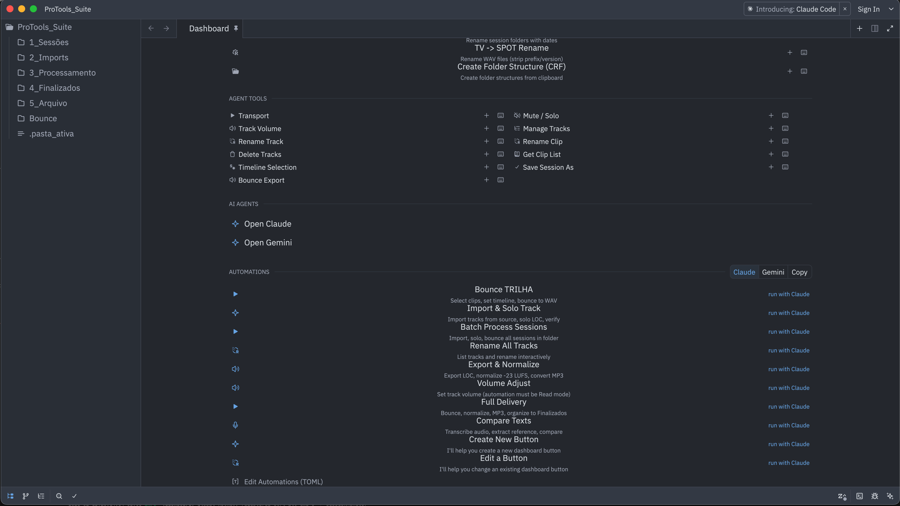
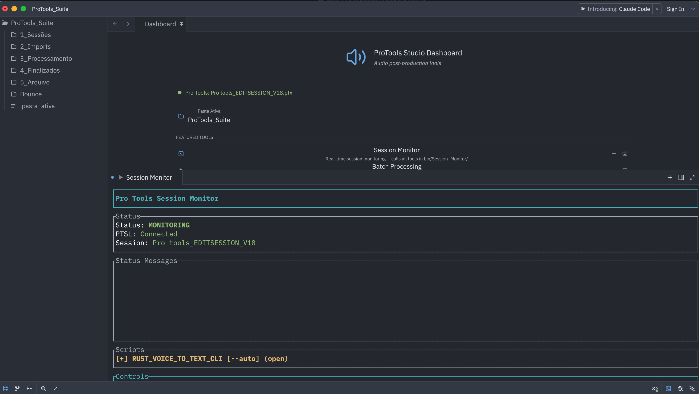

# PostProd Tools

> **TL;DR:** A macOS app that sits next to Pro Tools and does the boring stuff for you. 30+ tools for bouncing, normalizing, batch processing, and file management — all talking to Pro Tools directly via gRPC. Plus AI agents that can chain it all together from a single prompt.

A native macOS application for audio post-production. One app, one window — a dashboard with 30+ automation tools that talk directly to Avid Pro Tools, plus AI agents that can run entire delivery workflows autonomously.

Built on top of [Zed](https://github.com/zed-industries/zed), the GPU-accelerated code editor.



**Expected launch: March 13, 2026** — The application is in active daily use for real production work. The remaining work is packaging everything into a single `.app` bundle that runs out of the box with no setup.

## Who this is for

### Production companies

Audio post-production for broadcast, advertising, and streaming is a volume game. A single production company might deliver dozens of spots per day — each one requiring the same sequence of steps: open session, import tracks, solo the right stems, bounce, normalize to broadcast loudness standards (-23 LUFS), convert formats, rename files to network specs, and organize deliveries. Multiply that by every editor on the team, every day, every client.

These are hours of mechanical, repetitive work that require precision but not creativity. A missed normalization, a wrong filename, a forgotten MP3 conversion — any of these means a rejected delivery and wasted time.

PostProd Tools was built for this reality. It replaces the manual repetition with one-click tools and AI-driven workflows that handle the entire chain — from open session to verified delivery — while the engineer focuses on the actual creative work.

### Independent creators and YouTubers

You don't need a production company to have a production problem. If you're a YouTuber, a podcaster, or an independent audio creator, you know the feeling: the creative work takes an hour, the file management takes another hour. Renaming episodes, converting formats, normalizing loudness for different platforms, organizing folders — none of this is creative work, but it still eats your time.

PostProd Tools is not limited to Pro Tools. Many of the tools work directly on files and folders — no DAW required:

- **File renaming** — Batch rename audio files to match naming conventions, strip prefixes, add dates, convert between naming standards
- **Format conversion** — Convert between WAV, MP3, and other formats in bulk
- **Loudness normalization** — Normalize audio to broadcast standards (EBU R128) or platform targets
- **Peak maximization** — Maximize audio levels without clipping
- **Folder organization** — Create standardized project structures, move and sort files by type or date

These tools run from the dashboard with a single click. If Pro Tools is running, the session-aware tools light up. If it's not, the standalone tools still work — they operate on whatever files and folders you point them at.

## What you get

### A single application

Download, open, and start working. PostProd Tools is a native macOS app — not a browser tool, not a plugin, not a collection of scripts you need to install separately. Every tool is bundled inside the application. The dashboard shows your tools, your sessions, and your delivery status in one window.

### 30+ tools that control Pro Tools directly

Every tool communicates with Pro Tools over the PTSL gRPC protocol. This means:

- Tools don't simulate mouse clicks or keyboard shortcuts. They send commands directly to the Pro Tools engine.
- They don't break when Avid updates the UI. The protocol is versioned and stable.
- They execute instantly. No waiting for screen elements to appear, no timing-dependent scripting.

| Category | Tools |
|----------|-------|
| **Session** | Bounce All, Session Monitor, Import & Spot Clips, Save + Increment, Batch Processing, Voice to Text Compare |
| **Mixer** | Transport, Mute/Solo, Track Volume, Manage Tracks, Rename Track/Clip, Delete Tracks, Timeline Selection, Bounce Export |
| **Audio** | Normalize (EBU R128), Maximize Peaks, Convert MP3/WAV, TV Converter |
| **File** | Folder Renamer, TV to SPOT Rename, Create Folder Structure |

### Session Monitor — the always-on autopilot

Session Monitor is the centerpiece of PostProd Tools. It runs in the background and watches what happens in Pro Tools — when you open a session, when you save, when you close. And it acts on it.



**What it does today:**
- Detects when a session opens and automatically configures Pro Tools — window layout, track visibility, routing, the way you prefer to work
- Runs scripts on session events: auto-save a new version before you start editing, execute a task list when you save, trigger delivery processing when you close
- Monitors PTSL connection status in real time — you always know if Pro Tools is reachable
- Chains with other tools: open a session, import tracks from a source, solo what you need, and start monitoring — all without a single manual click

**What's coming:**
- Full screen layout presets — save and restore your preferred Pro Tools window arrangement per project or per client
- Expanded event triggers — react to track changes, marker creation, timeline selections
- Conditional scripts — "if the session name contains SPOT, run the SPOT workflow automatically"

No other Pro Tools automation tool works this way. SoundFlow macros run when you press a button. Keyboard Maestro macros run when you press a key. Session Monitor runs by itself — it watches, it reacts, it chains. You open a session and everything is already configured. You save and the backup is already done. You close and the delivery is already processing.

It is the fastest path from "session opened" to "files delivered" because there is no path — it just happens.

### System-wide keyboard shortcuts

Assign a global hotkey to any tool. Press it from Pro Tools — without switching apps — and the tool runs. The shortcut capture modal lets you record any key combination and saves it instantly.

### Session awareness

The app detects your open Pro Tools session automatically. The window title shows the session name, a status indicator shows whether Pro Tools is connected, and every session-aware tool receives the correct session path without you typing anything.

### Organized project workspace

The file explorer shows your entire delivery structure side by side:

```
ProTools_Suite/
├── 1_Sessoes/          ← Pro Tools sessions
├── 2_Imports/          ← Source audio
├── 3_Processamento/    ← Work in progress
├── 4_Finalizados/      ← Delivery-ready files
└── 5_Arquivo/          ← Archive
```

You see your sessions, exports, and deliveries in one place — with search, git tracking, and a built-in terminal.

### Delivery monitoring

A background scan checks your delivery folder and reports what's ready: TV versions, NET versions, SPOT versions, MP3s. Color-coded badges show what's complete and what's missing. No more manually counting files before sending to the client.

## AI agents — not just an assistant

PostProd Tools integrates autonomous AI agents (Claude Code, Gemini CLI) that run in the built-in terminal. This is fundamentally different from chat-based assistants like SoundFlow's [Session Assistant](https://soundflow.org/session-assistant):

| | **PostProd Tools agents** | **SoundFlow Session Assistant** |
|---|---|---|
| Reads your file tree | Yes — sees sessions, audio, exports | No — only sees Pro Tools session state |
| Creates/edits files | Yes — renames exports, moves deliveries, writes scripts | No — limited to Pro Tools track operations |
| Chains multiple tools | Yes — import → solo → bounce → normalize → rename in one prompt | No — one command at a time |
| Runs autonomously | Yes — headless mode executes entire workflows end-to-end | No — requires human input at each step |
| Works outside Pro Tools | Yes — file operations, audio processing, format conversion | No — Pro Tools only |

A concrete example: you click "Full Delivery" in the dashboard and the agent autonomously bounces the session, normalizes to -23 LUFS, converts to MP3, renames files for broadcast standards, organizes them into delivery folders, and verifies the output — all from a single click. The agent decides what to do at each step based on what it finds on disk.

Automations are defined in a simple TOML file. Add or edit them at any time — the dashboard picks up changes automatically. No recompilation, no restarts.

## How it compares

| | **PostProd Tools** | **[SoundFlow](https://soundflow.org/)** | **[Keyboard Maestro](https://www.keyboardmaestro.com/)** | **Custom scripts** |
|---|---|---|---|---|
| **How it talks to PT** | gRPC (PTSL protocol) | SFX protocol + GUI hooks | GUI simulation (clicks, keystrokes) | AppleScript / osascript |
| **Breaks on UI changes** | No | Partially | Yes | Often |
| **AI agents** | Autonomous (Claude + Gemini) | Chat assistant (premium) | No | No |
| **File/folder awareness** | Full workspace (editor, git, tree) | No | No | No |
| **Session awareness** | Automatic (live polling) | Via SFX framework | Manual | Manual |
| **System-wide hotkeys** | Yes | Yes (MIDI/OSC/keys) | Yes | No |

### What SoundFlow does well

[SoundFlow](https://soundflow.org/) is a well-established automation tool for Pro Tools. It ships with 1,700+ pre-built macros, supports Stream Deck and MIDI triggers, and has a JavaScript scripting engine. For individual editors who want ready-made macros and a polished UI, SoundFlow is a solid choice.

### Where PostProd Tools is different

PostProd Tools is not trying to replace SoundFlow's macro library. It solves a different problem: **automating the entire post-production pipeline** — not just what happens inside Pro Tools, but everything around it. File management, audio processing, format conversion, delivery verification, and the repetitive session-to-session workflow that eats hours every day.

The tools don't simulate the Pro Tools interface. They talk to the engine directly. And the AI agents don't just execute single commands — they run multi-step workflows end-to-end, reading your project structure and making decisions based on what they find.

## Built entirely in Rust

Everything — the application, the dashboard, and every single tool — is written in Rust. This is not a technical curiosity. It has real consequences:

- **Instant execution** — Every tool is a compiled native binary. No interpreter startup, no VM warmup. When you're processing 40 sessions in a batch, the difference between a 200ms tool and a 2-second script adds up to minutes saved per run.

- **GPU-accelerated interface** — The entire UI is rendered on the GPU via [GPUI](https://www.gpui.rs/). Scrolling through hundreds of tracks or scanning a delivery folder with thousands of files stays smooth. There is no Electron, no web view, no garbage collector pausing the interface.

- **Low memory footprint** — No runtime overhead, no garbage collector. The application uses a fraction of the memory that browser-based tools consume. On a machine already running Pro Tools, this matters.

- **Reliability at scale** — Rust catches entire categories of bugs at compile time. When batch processing runs across dozens of sessions overnight, the tools either work correctly or don't compile at all. They don't silently corrupt data at 3 AM.

The same language runs from the gRPC protocol layer talking to Pro Tools all the way up to the GPU-rendered dashboard buttons. There is no glue code, no bridge between languages. It is Rust all the way down.

## Current state

The application is in active daily use for real audio post-production work on macOS (Apple Silicon and Intel). What remains before the March 13 launch:

- Bundling all tools inside the `.app` package (currently resolved from a companion build)
- Custom application icon
- Code signing for macOS distribution
- Installer and first-launch experience

For developers interested in the tool binaries: see the companion [PostProd Tools](https://github.com/Caio-Ze/postprod-tools) repository.

## License

This repository (the IDE) is a fork of [Zed](https://github.com/zed-industries/zed) and is open source. The original Zed code is licensed under AGPL-3.0 and Apache-2.0. New code added for PostProd Tools is licensed under GPL-3.0-or-later.

The companion tool binaries ([PostProd Tools](https://github.com/Caio-Ze/postprod-tools)) are distributed separately and are not covered by this license.

